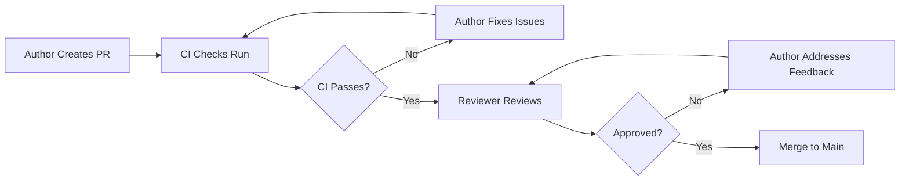

# 📋 Code Review Guidelines

This document outlines the standards and best practices for code reviews in this project.

## 🎯 Purpose

Code reviews ensure:
- **Code Quality**: Maintainable, readable, and performant code
- **Consistency**: Uniform patterns and styles across the codebase
- **Security**: Identify potential vulnerabilities and security issues
- **Knowledge Sharing**: Team members learn from each other
- **Bug Prevention**: Catch issues before they reach production

---

## ✅ Review Checklist

### 1. Functionality
- [ ] Does the code work as intended?
- [ ] Are all edge cases handled?
- [ ] Are error cases properly handled?
- [ ] Are there any potential bugs or race conditions?
- [ ] Does it meet the requirements/acceptance criteria?

### 2. Code Quality
- [ ] Is the code readable and self-documenting?
- [ ] Are functions small and focused (single responsibility)?
- [ ] Is there code duplication that should be extracted?
- [ ] Are magic numbers replaced with named constants?
- [ ] Is the code complexity reasonable? (use complexity analysis tools)

### 3. Performance
- [ ] Are there any performance issues?
- [ ] Are expensive operations optimized?
- [ ] Are unnecessary re-renders avoided?
- [ ] Are API calls properly debounced/throttled?
- [ ] Is bundle size considered?

### 4. Security
- [ ] Are user inputs validated and sanitized?
- [ ] Are sensitive data handled securely?
- [ ] Are API endpoints properly authenticated?
- [ ] Are there any XSS vulnerabilities?
- [ ] Are secrets properly managed (not hardcoded)?

### 5. Testing
- [ ] Are there unit tests for new code?
- [ ] Are edge cases covered in tests?
- [ ] Are E2E tests added for critical flows?
- [ ] Is test coverage maintained/improved?
- [ ] Do tests follow the testing guidelines?

### 6. Accessibility
- [ ] Are ARIA attributes used correctly?
- [ ] Is keyboard navigation supported?
- [ ] Are color contrasts sufficient?
- [ ] Are screen readers considered?
- [ ] Does it pass accessibility audits?

### 7. Documentation
- [ ] Is code properly commented (where needed)?
- [ ] Are JSDoc comments added for public APIs?
- [ ] Is README updated if needed?
- [ ] Are breaking changes documented?

### 8. TypeScript
- [ ] Are types properly defined?
- [ ] Are `any` types avoided?
- [ ] Are type errors resolved?
- [ ] Are interfaces exported when needed?

### 9. Styling
- [ ] Is Tailwind CSS used consistently?
- [ ] Are responsive breakpoints considered?
- [ ] Is dark mode supported?
- [ ] Are design system tokens used?

### 10. Git & Commits
- [ ] Is the commit message clear and descriptive?
- [ ] Are commits atomic (one logical change per commit)?
- [ ] Are merge conflicts resolved?
- [ ] Is the branch up to date with main/develop?

---

## 🔍 Review Process

### For Authors

1. **Before Submitting**:
   - Self-review your code
   - Run linters and tests locally
   - Ensure CI checks pass
   - Write clear PR description

2. **PR Description Template**:
   ```markdown
   ## Description
   Brief description of changes

   ## Type of Change
   - [ ] Bug fix
   - [ ] New feature
   - [ ] Refactoring
   - [ ] Documentation
   - [ ] Performance improvement

   ## Testing
   - [ ] Unit tests added/updated
   - [ ] E2E tests added/updated
   - [ ] Manual testing performed

   ## Checklist
   - [ ] Code follows style guidelines
   - [ ] Self-review completed
   - [ ] Comments added for complex logic
   - [ ] Documentation updated
   - [ ] No new warnings generated
   ```

### For Reviewers

1. **Review Priority**:
   - **P0 (Critical)**: Security issues, breaking changes, data loss risks
   - **P1 (High)**: Bugs, performance issues, missing tests
   - **P2 (Medium)**: Code quality, refactoring opportunities
   - **P3 (Low)**: Style, documentation, minor improvements

2. **Review Timing**:
   - Small PRs (< 200 lines): Within 4 hours
   - Medium PRs (200-500 lines): Within 8 hours
   - Large PRs (> 500 lines): Within 24 hours

3. **Review Comments**:
   - **Must Fix**: Blocking issues that must be addressed
   - **Should Fix**: Important improvements, but not blocking
   - **Nice to Have**: Optional suggestions for future improvements
   - **Question**: Clarifications needed

4. **Approval Criteria**:
   - All "Must Fix" issues resolved
   - At least one approval from team member
   - CI checks passing
   - No unresolved discussions

---

## 🚫 Common Issues to Watch For

### Code Duplication
- **Issue**: Similar code patterns repeated across files
- **Solution**: Extract shared utilities, hooks, or components
- **Example**: Form field validation, API error handling

### Complexity
- **Issue**: Functions with high cyclomatic complexity (> 10)
- **Solution**: Break down into smaller functions
- **Tool**: Use `eslint-plugin-complexity`

### Missing Error Handling
- **Issue**: Unhandled promise rejections, missing try-catch
- **Solution**: Add proper error boundaries and error handling
- **Example**: API calls without error handling

### Security Vulnerabilities
- **Issue**: XSS, SQL injection, exposed secrets
- **Solution**: Input validation, parameterized queries, env vars
- **Tool**: Use security scanning tools

### Performance Issues
- **Issue**: Unnecessary re-renders, missing memoization
- **Solution**: Use React.memo, useMemo, useCallback appropriately
- **Tool**: React DevTools Profiler

### Accessibility Issues
- **Issue**: Missing ARIA labels, keyboard navigation
- **Solution**: Add proper ARIA attributes, test with screen readers
- **Tool**: axe DevTools, Lighthouse

---

## 📊 Code Metrics

### Complexity Thresholds
- **Cyclomatic Complexity**: < 10 (warning), < 15 (error)
- **Function Length**: < 50 lines (warning), < 100 lines (error)
- **File Length**: < 300 lines (warning), < 500 lines (error)
- **Nesting Depth**: < 4 levels (warning), < 5 levels (error)

### Coverage Thresholds
- **Critical Paths**: 95%+ coverage
- **Auth/Security**: 90%+ coverage
- **Business Logic**: 85%+ coverage
- **UI Components**: 80%+ coverage

---

## 🛠️ Tools & Automation

### Automated Checks
- **Linting**: ESLint with complexity plugin
- **Type Checking**: TypeScript compiler
- **Testing**: Vitest (unit), Playwright (E2E)
- **Security**: Dependabot, npm audit
- **Performance**: Bundle size checks, Lighthouse CI

### Manual Review Tools
- **Code Complexity**: `eslint-plugin-complexity`
- **Bundle Analysis**: `@next/bundle-analyzer`
- **Accessibility**: axe DevTools
- **Performance**: React DevTools Profiler

---

## 💬 Review Etiquette

### For Authors
- ✅ Be open to feedback
- ✅ Respond to comments promptly
- ✅ Ask questions if feedback is unclear
- ✅ Thank reviewers for their time

### For Reviewers
- ✅ Be constructive and respectful
- ✅ Explain the "why" behind suggestions
- ✅ Focus on code, not the person
- ✅ Approve when criteria are met
- ✅ Use "suggestions" for minor changes

---

## 📚 Resources

- [React Best Practices](https://react.dev/learn)
- [TypeScript Handbook](https://www.typescriptlang.org/docs/)
- [Accessibility Guidelines (WCAG)](https://www.w3.org/WAI/WCAG21/quickref/)
- [Security Best Practices](https://owasp.org/www-project-top-ten/)
- [Performance Optimization](https://web.dev/performance/)

---

## 🔄 Review Workflow



---

## 📝 Review Comments Examples

### Good Review Comment
```typescript
// ❌ Bad
"This is wrong"

// ✅ Good
"This function has high complexity (15). Consider breaking it down:
- Extract validation logic into `validateInput()`
- Extract API call into `fetchUserData()`
- This will improve testability and maintainability."
```

### Constructive Feedback
```typescript
// ❌ Bad
"Use a better approach"

// ✅ Good
"Consider using `useApi` hook here instead of manual fetch. It provides:
- Built-in loading/error states
- Retry logic
- Consistent error handling
Example: const { data, isLoading } = useApi({ url: '/api/users' });"
```

---

## ✅ Approval Checklist

Before approving a PR, ensure:

- [ ] All "Must Fix" issues resolved
- [ ] Code follows project style guide
- [ ] Tests are added/updated
- [ ] Documentation is updated
- [ ] No security vulnerabilities
- [ ] Performance is acceptable
- [ ] Accessibility requirements met
- [ ] CI checks passing
- [ ] No merge conflicts

---

**Last Updated**: 2025-01-25  
**Maintained By**: Development Team

