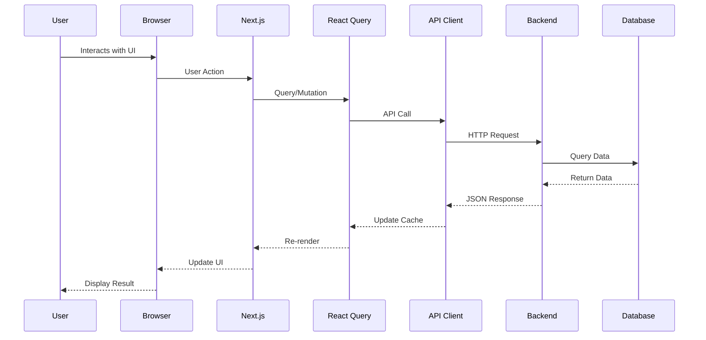
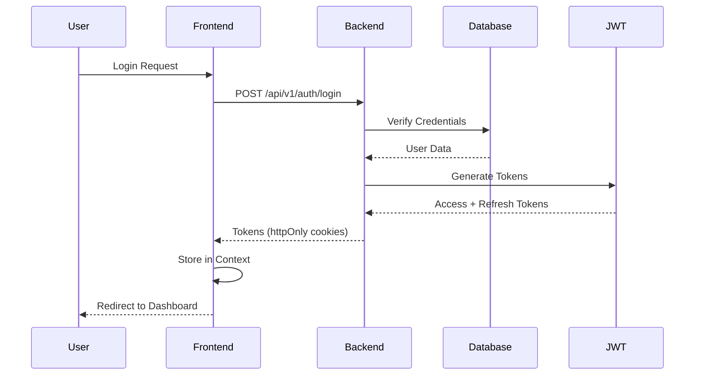
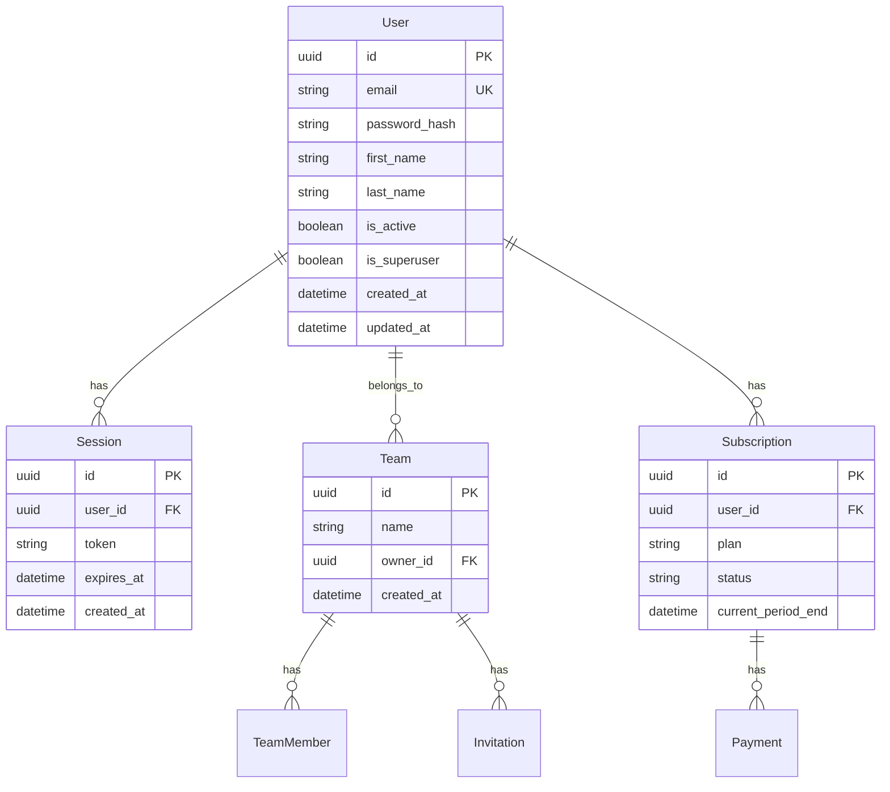
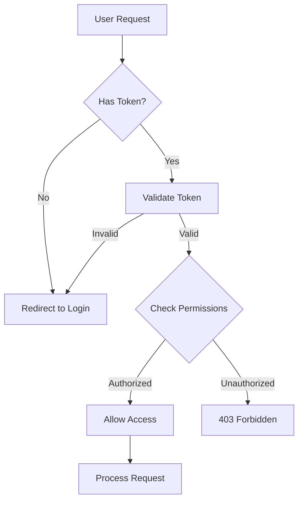
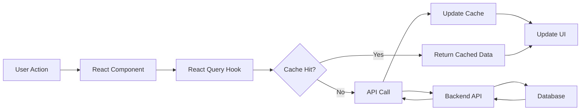
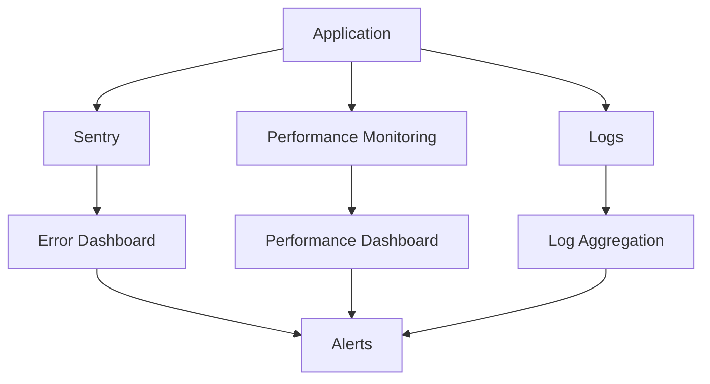
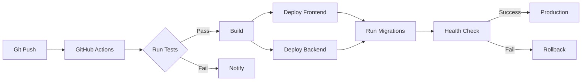

# 🏗️ Architecture Documentation

Complete architecture overview of the MODELE-NEXTJS-FULLSTACK application.

---

## 📐 System Architecture

### High-Level Overview

```
┌─────────────────────────────────────────────────────────────┐
│                        CLIENT LAYER                          │
│  ┌──────────────┐  ┌──────────────┐  ┌──────────────┐   │
│  │   Browser    │  │   Mobile Web  │  │   Desktop     │   │
│  └──────┬───────┘  └──────┬────────┘  └──────┬────────┘   │
└─────────┼─────────────────┼──────────────────┼────────────┘
          │                 │                  │
          └─────────────────┼──────────────────┘
                            │
┌───────────────────────────┼───────────────────────────────┐
│                    FRONTEND LAYER                           │
│  ┌─────────────────────────────────────────────────────┐  │
│  │         Next.js 16 Application (apps/web)           │  │
│  │  ┌──────────┐  ┌──────────┐  ┌──────────┐        │  │
│  │  │   App    │  │  Pages   │  │ Components│        │  │
│  │  │  Router  │  │  (RSC)   │  │   (UI)    │        │  │
│  │  └────┬─────┘  └────┬─────┘  └────┬─────┘        │  │
│  │       │             │              │               │  │
│  │  ┌────┴─────────────┴──────────────┴─────┐       │  │
│  │  │      React Query (State Management)     │       │  │
│  │  └─────────────────────────────────────────┘       │  │
│  │                                                     │  │
│  │  ┌──────────┐  ┌──────────┐  ┌──────────┐       │  │
│  │  │  Auth    │  │  Themes  │  │ Monitoring│       │  │
│  │  │ Context  │  │ Context  │  │  (Sentry) │       │  │
│  │  └──────────┘  └──────────┘  └──────────┘       │  │
│  └──────────────────────┬─────────────────────────────┘  │
└──────────────────────────┼─────────────────────────────────┘
                           │ HTTPS/REST API
┌──────────────────────────┼─────────────────────────────────┐
│                    BACKEND LAYER                            │
│  ┌─────────────────────────────────────────────────────┐  │
│  │         FastAPI Application (backend)               │  │
│  │  ┌──────────┐  ┌──────────┐  ┌──────────┐        │  │
│  │  │   API    │  │  Auth    │  │ Business │        │  │
│  │  │ Routes   │  │  (JWT)   │  │  Logic   │        │  │
│  │  └────┬─────┘  └────┬─────┘  └────┬─────┘        │  │
│  │       │             │              │               │  │
│  │  ┌────┴─────────────┴──────────────┴─────┐       │  │
│  │  │      SQLAlchemy (ORM)                  │       │  │
│  │  └─────────────────────────────────────────┘       │  │
│  └──────────────────────┬─────────────────────────────┘  │
└──────────────────────────┼─────────────────────────────────┘
                           │
┌──────────────────────────┼─────────────────────────────────┐
│                    DATA LAYER                              │
│  ┌──────────┐  ┌──────────┐  ┌──────────┐              │
│  │PostgreSQL│  │  Redis   │  │   S3/SG   │              │
│  │ (Primary)│  │ (Cache)  │  │ (Storage) │              │
│  └──────────┘  └──────────┘  └──────────┘              │
└───────────────────────────────────────────────────────────┘
```

---

## 🔄 Request Flow

### Frontend Request Flow



### Authentication Flow



---

## 📁 Project Structure

### Monorepo Architecture

```
MODELE-NEXTJS-FULLSTACK/
├── apps/
│   └── web/                    # Next.js Frontend
│       ├── src/
│       │   ├── app/            # App Router (Pages)
│       │   ├── components/     # React Components
│       │   ├── lib/            # Utilities & Helpers
│       │   ├── hooks/          # Custom React Hooks
│       │   └── contexts/        # React Contexts
│       ├── public/             # Static Assets
│       └── package.json
│
├── backend/                    # FastAPI Backend
│   ├── app/
│   │   ├── api/                # API Endpoints
│   │   ├── models/             # SQLAlchemy Models
│   │   ├── schemas/            # Pydantic Schemas
│   │   ├── core/               # Configuration
│   │   └── main.py             # Application Entry
│   ├── alembic/                # Database Migrations
│   └── requirements.txt
│
├── packages/
│   └── types/                  # Shared TypeScript Types
│       └── src/
│           └── generated.ts   # Auto-generated from Pydantic
│
├── scripts/                     # Automation Scripts
├── templates/                   # Module Templates
└── package.json                 # Monorepo Root
```

---

## 🗄️ Database Schema

### Core Entities



---

## 🔐 Security Architecture

### Security Layers

```
┌─────────────────────────────────────────────────┐
│           SECURITY LAYERS                       │
├─────────────────────────────────────────────────┤
│ 1. HTTPS/TLS Encryption (Transport)            │
│ 2. CORS Protection (Origin Validation)         │
│ 3. CSP Headers (Content Security Policy)       │
│ 4. Authentication (JWT Tokens)                 │
│ 5. Authorization (RBAC)                        │
│ 6. Input Validation (Zod/Pydantic)             │
│ 7. SQL Injection Prevention (ORM)              │
│ 8. XSS Protection (DOMPurify)                  │
│ 9. Rate Limiting (API)                         │
│ 10. Error Handling (No Sensitive Data)         │
└─────────────────────────────────────────────────┘
```

### Authentication & Authorization Flow



---

## 🚀 Deployment Architecture

### Production Deployment

```
┌─────────────────────────────────────────────────────┐
│              PRODUCTION ENVIRONMENT                 │
├─────────────────────────────────────────────────────┤
│                                                     │
│  ┌─────────────────────────────────────────────┐  │
│  │         CDN / Edge Network                  │  │
│  │  (Vercel Edge / Cloudflare)                 │  │
│  └──────────────────┬──────────────────────────┘  │
│                     │                               │
│  ┌──────────────────┴──────────────────────────┐  │
│  │         Frontend (Vercel/Railway)            │  │
│  │  ┌──────────────────────────────────────┐   │  │
│  │  │  Next.js App (Static + SSR)          │   │  │
│  │  │  - Static Pages (CDN)                │   │  │
│  │  │  - API Routes (Serverless)            │   │  │
│  │  │  - Edge Functions                     │   │  │
│  │  └──────────────────────────────────────┘   │  │
│  └──────────────────┬──────────────────────────┘  │
│                     │ HTTPS                         │
│  ┌──────────────────┴──────────────────────────┐  │
│  │         Backend (Railway/Render)              │  │
│  │  ┌──────────────────────────────────────┐   │  │
│  │  │  FastAPI Application                 │   │  │
│  │  │  - API Endpoints                     │   │  │
│  │  │  - Background Jobs                   │   │  │
│  │  └──────────────────────────────────────┘   │  │
│  └──────────────────┬──────────────────────────┘  │
│                     │                               │
│  ┌──────────────────┴──────────────────────────┐  │
│  │         Data Layer                            │  │
│  │  ┌──────────┐  ┌──────────┐  ┌──────────┐ │  │
│  │  │PostgreSQL│  │  Redis    │  │   S3     │ │  │
│  │  │(Railway) │  │(Optional) │  │(AWS)     │ │  │
│  │  └──────────┘  └──────────┘  └──────────┘ │  │
│  └──────────────────────────────────────────────┘  │
│                                                     │
│  ┌─────────────────────────────────────────────┐  │
│  │         Monitoring & Observability           │  │
│  │  - Sentry (Error Tracking)                  │  │
│  │  - Performance Monitoring                   │  │
│  │  - Logs (Railway/Vercel)                    │  │
│  └─────────────────────────────────────────────┘  │
└─────────────────────────────────────────────────────┘
```

---

## 🔄 Data Flow

### State Management Flow



---

## 🧩 Component Architecture

### Frontend Component Hierarchy

```
App (Root)
├── ErrorBoundary
│   └── AppProviders
│       ├── ThemeProvider
│       ├── AuthProvider
│       └── QueryClientProvider
│           └── Layout
│               ├── Header
│               ├── Sidebar (if authenticated)
│               └── Main Content
│                   └── Page Components
│                       ├── UI Components
│                       ├── Form Components
│                       └── Data Components
```

---

## 📊 Performance Architecture

### Optimization Strategies

```
┌─────────────────────────────────────────────┐
│         PERFORMANCE OPTIMIZATIONS            │
├─────────────────────────────────────────────┤
│ 1. Code Splitting (Route-based)              │
│ 2. Image Optimization (Next.js Image)       │
│ 3. Static Generation (SSG)                  │
│ 4. Incremental Static Regeneration (ISR)    │
│ 5. React Server Components (RSC)            │
│ 6. API Response Caching (React Query)        │
│ 7. Database Query Optimization (Indexes)    │
│ 8. CDN Caching (Static Assets)               │
│ 9. Bundle Optimization (Tree Shaking)       │
│ 10. Lazy Loading (Components & Routes)       │
└─────────────────────────────────────────────┘
```

---

## 🔌 Integration Points

### External Services

```
┌─────────────────────────────────────────────┐
│         EXTERNAL INTEGRATIONS                │
├─────────────────────────────────────────────┤
│ • Sentry (Error Tracking)                   │
│ • Stripe (Payments)                          │
│ • SendGrid (Email)                           │
│ • AWS S3 (File Storage)                      │
│ • Google OAuth (Authentication)              │
│ • OpenAI (AI Features)                      │
└─────────────────────────────────────────────┘
```

---

## 📈 Scalability Considerations

### Horizontal Scaling

```
┌─────────────────────────────────────────────┐
│         SCALABILITY ARCHITECTURE             │
├─────────────────────────────────────────────┤
│ Frontend:                                     │
│ • Stateless (Easy to Scale)                  │
│ • CDN Distribution                            │
│ • Edge Functions                              │
│                                               │
│ Backend:                                      │
│ • Stateless API                               │
│ • Load Balancer                               │
│ • Multiple Instances                          │
│                                               │
│ Database:                                     │
│ • Read Replicas                               │
│ • Connection Pooling                          │
│ • Query Optimization                          │
│                                               │
│ Cache:                                        │
│ • Redis Cluster                               │
│ • CDN Caching                                 │
└─────────────────────────────────────────────┘
```

---

## 🔍 Monitoring Architecture

### Observability Stack



---

## 📚 Technology Stack

### Frontend Stack

- **Framework**: Next.js 16 (App Router)
- **UI Library**: React 19
- **Language**: TypeScript
- **Styling**: Tailwind CSS
- **State Management**: React Query (TanStack Query)
- **Forms**: React Hook Form + Zod
- **Authentication**: NextAuth.js
- **Monitoring**: Sentry

### Backend Stack

- **Framework**: FastAPI
- **Language**: Python 3.11+
- **ORM**: SQLAlchemy (Async)
- **Validation**: Pydantic
- **Database**: PostgreSQL
- **Cache**: Redis (Optional)
- **Migrations**: Alembic

### Infrastructure

- **Frontend Hosting**: Vercel / Railway
- **Backend Hosting**: Railway / Render
- **Database**: PostgreSQL (Railway)
- **File Storage**: AWS S3
- **Email**: SendGrid
- **Payments**: Stripe

---

## 🔐 Security Architecture Details

### Authentication Flow

1. **User Login**
   - Credentials validated
   - JWT tokens generated
   - Tokens stored in httpOnly cookies
   - Refresh token rotation

2. **Request Authentication**
   - Token extracted from cookie
   - Token validated
   - User context set
   - Request processed

3. **Authorization**
   - Role-based access control (RBAC)
   - Permission checks
   - Resource-level permissions

### Data Protection

- **Encryption at Rest**: Database encryption
- **Encryption in Transit**: HTTPS/TLS
- **Password Hashing**: bcrypt/argon2
- **Token Security**: httpOnly cookies, short expiration
- **Input Sanitization**: Zod/Pydantic validation
- **XSS Protection**: DOMPurify, CSP headers

---

## 🚀 Deployment Flow

### CI/CD Pipeline



---

## 📖 Additional Resources

- [Next.js Architecture](https://nextjs.org/docs)
- [FastAPI Architecture](https://fastapi.tiangolo.com/)
- [React Query Architecture](https://tanstack.com/query/latest)
- [Database Design Best Practices](./DATABASE_DESIGN.md)

---

**Last Updated**: 2025-01-25

