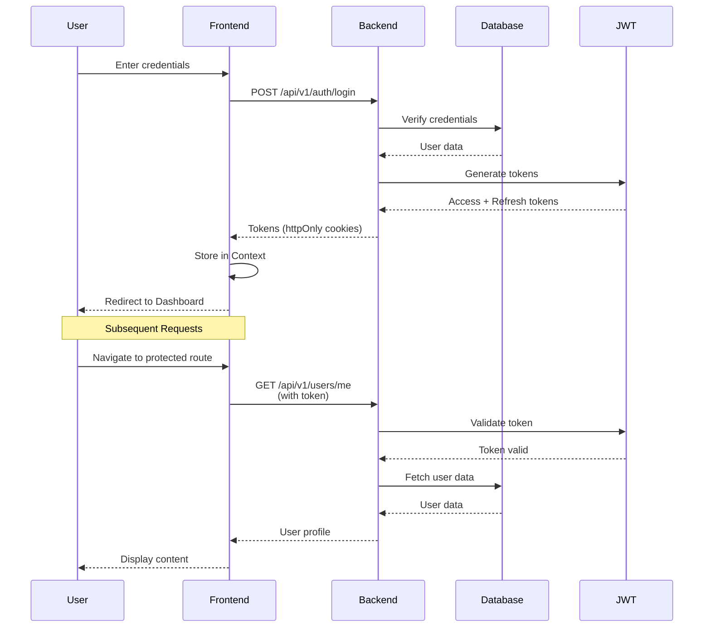
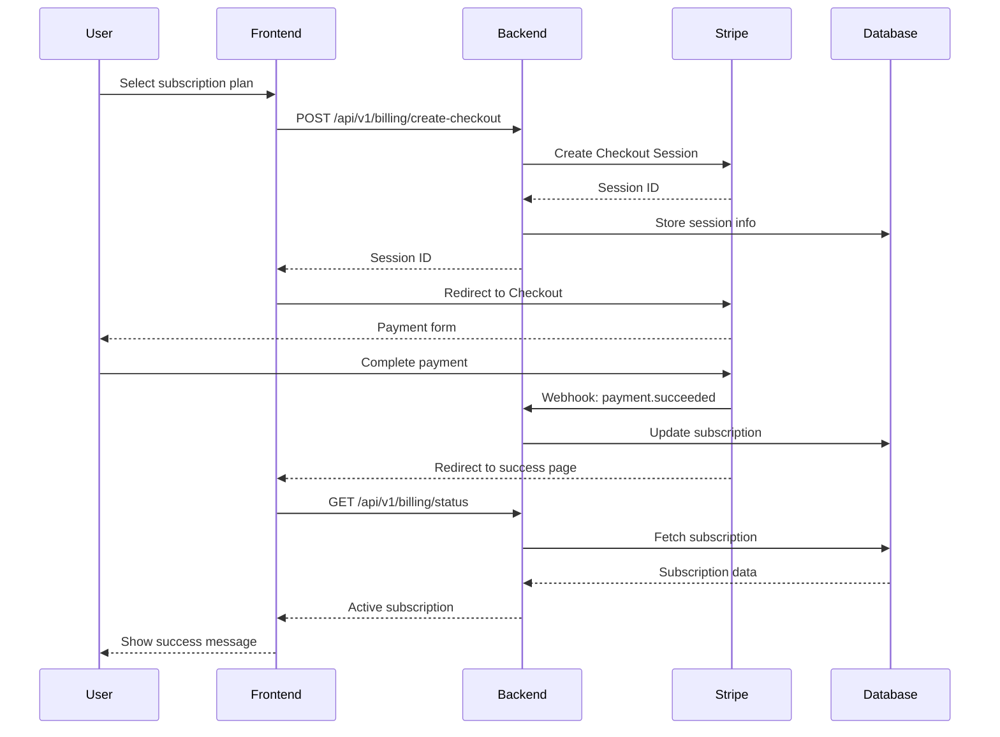
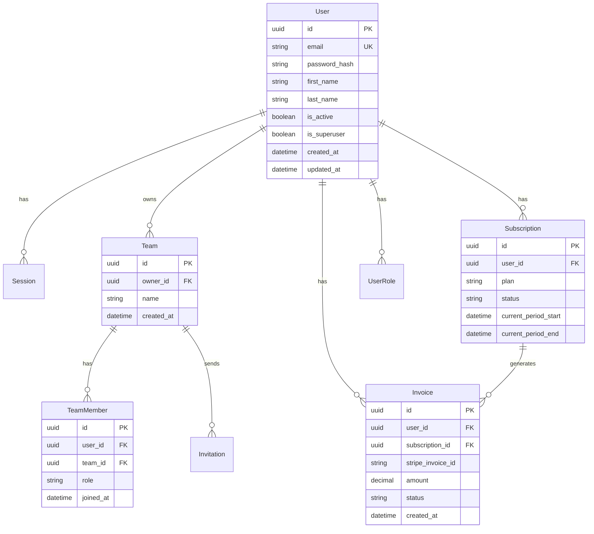
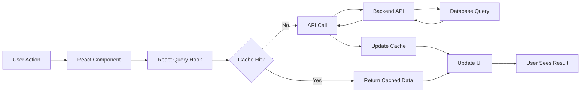
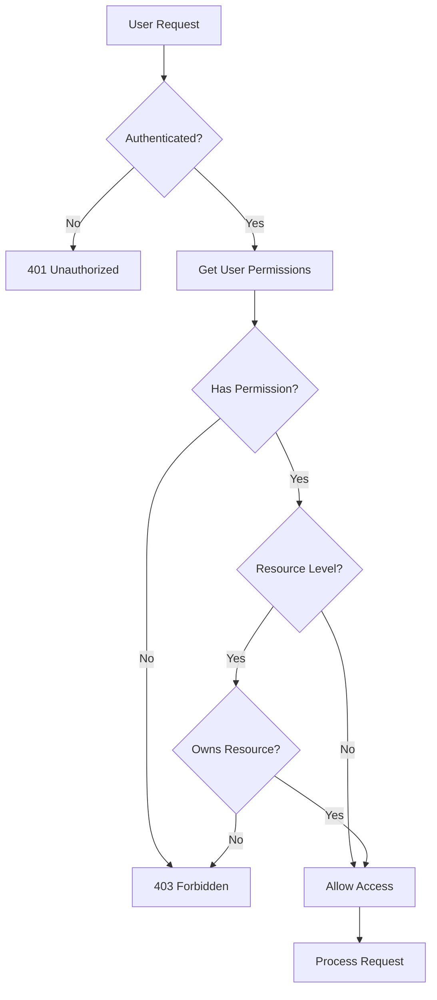

# 📐 Architecture Diagrams

Visual representations of the system architecture, data flow, and component relationships.

---

## 🏗️ System Architecture Overview

```
┌─────────────────────────────────────────────────────────────────┐
│                         CLIENT LAYER                            │
│  ┌──────────────┐  ┌──────────────┐  ┌──────────────┐        │
│  │   Browser    │  │   Mobile     │  │   Desktop    │        │
│  │   (Chrome)   │  │   (Safari)   │  │   (Electron) │        │
│  └──────┬───────┘  └──────┬───────┘  └──────┬───────┘        │
└─────────┼──────────────────┼──────────────────┼────────────────┘
          │                  │                  │
          └──────────────────┼──────────────────┘
                             │ HTTPS/TLS
┌────────────────────────────┼────────────────────────────────────┐
│                    FRONTEND LAYER                                │
│  ┌───────────────────────────────────────────────────────────┐  │
│  │         Next.js 16 Application (apps/web)                 │  │
│  │                                                           │  │
│  │  ┌──────────────┐  ┌──────────────┐  ┌──────────────┐ │  │
│  │  │   App        │  │   Pages      │  │ Components   │ │  │
│  │  │   Router     │  │   (RSC)      │  │   (255+)     │ │  │
│  │  └──────┬───────┘  └──────┬───────┘  └──────┬───────┘ │  │
│  │         │                  │                  │          │  │
│  │  ┌──────┴──────────────────┴──────────────────┴──────┐  │  │
│  │  │      React Query (State Management & Caching)     │  │  │
│  │  └───────────────────────────────────────────────────┘  │  │
│  │                                                           │  │
│  │  ┌──────────┐  ┌──────────┐  ┌──────────┐  ┌────────┐ │  │
│  │  │  Auth    │  │  Theme   │  │   i18n   │  │ Monitor│ │  │
│  │  │ Context  │  │ Context  │  │ Context  │  │ (Sentry)│ │  │
│  │  └──────────┘  └──────────┘  └──────────┘  └────────┘ │  │
│  └───────────────────────┬───────────────────────────────────┘  │
└───────────────────────────┼───────────────────────────────────────┘
                           │ REST API (JSON)
┌───────────────────────────┼───────────────────────────────────────┐
│                    BACKEND LAYER                                  │
│  ┌───────────────────────────────────────────────────────────┐  │
│  │         FastAPI Application (backend)                     │  │
│  │                                                           │  │
│  │  ┌──────────────┐  ┌──────────────┐  ┌──────────────┐ │  │
│  │  │   API        │  │   Auth       │  │   Business   │ │  │
│  │  │   Routes     │  │   (JWT)      │  │   Logic      │ │  │
│  │  └──────┬───────┘  └──────┬───────┘  └──────┬───────┘ │  │
│  │         │                  │                  │          │  │
│  │  ┌──────┴──────────────────┴──────────────────┴──────┐  │  │
│  │  │      SQLAlchemy ORM (Async)                        │  │  │
│  │  └───────────────────────────────────────────────────┘  │  │
│  │                                                           │  │
│  │  ┌──────────┐  ┌──────────┐  ┌──────────┐             │  │
│  │  │  Rate    │  │  CORS    │  │ Security │             │  │
│  │  │  Limit   │  │  Middle  │  │ Headers  │             │  │
│  │  └──────────┘  └──────────┘  └──────────┘             │  │
│  └───────────────────────┬───────────────────────────────────┘  │
└───────────────────────────┼───────────────────────────────────────┘
                           │
┌───────────────────────────┼───────────────────────────────────────┐
│                    DATA LAYER                                     │
│  ┌──────────┐  ┌──────────┐  ┌──────────┐  ┌──────────┐       │
│  │PostgreSQL│  │  Redis   │  │   S3     │  │  Stripe  │       │
│  │ (Primary)│  │ (Cache)  │  │(Storage) │  │(Payments)│       │
│  └──────────┘  └──────────┘  └──────────┘  └──────────┘       │
└───────────────────────────────────────────────────────────────────┘
```

---

## 🔄 Authentication Flow Sequence Diagram



---

## 💳 Payment Processing Flow



---

## 🗄️ Database Schema Relationships



---

## 🔐 Security Layers

```
┌─────────────────────────────────────────────────────────┐
│              SECURITY LAYERS (Defense in Depth)         │
├─────────────────────────────────────────────────────────┤
│                                                         │
│  Layer 1: Transport Security                           │
│  ┌───────────────────────────────────────────────────┐ │
│  │ HTTPS/TLS Encryption                               │ │
│  │ - Certificate validation                           │ │
│  │ - Perfect Forward Secrecy                          │ │
│  └───────────────────────────────────────────────────┘ │
│                                                         │
│  Layer 2: Network Security                             │
│  ┌───────────────────────────────────────────────────┐ │
│  │ CORS Protection                                    │ │
│  │ Rate Limiting                                      │ │
│  │ IP Whitelisting (admin endpoints)                  │ │
│  └───────────────────────────────────────────────────┘ │
│                                                         │
│  Layer 3: Application Security                          │
│  ┌───────────────────────────────────────────────────┐ │
│  │ Security Headers (CSP, HSTS, X-Frame-Options)     │ │
│  │ Request Size Limits                                │ │
│  │ CSRF Protection                                    │ │
│  └───────────────────────────────────────────────────┘ │
│                                                         │
│  Layer 4: Authentication                                │
│  ┌───────────────────────────────────────────────────┐ │
│  │ JWT Tokens (httpOnly cookies)                     │ │
│  │ MFA/TOTP Support                                  │ │
│  │ OAuth Integration                                 │ │
│  │ Session Management                                │ │
│  └───────────────────────────────────────────────────┘ │
│                                                         │
│  Layer 5: Authorization                                 │
│  ┌───────────────────────────────────────────────────┐ │
│  │ Role-Based Access Control (RBAC)                  │ │
│  │ Resource-Level Permissions                        │ │
│  │ Permission Checks                                 │ │
│  └───────────────────────────────────────────────────┘ │
│                                                         │
│  Layer 6: Input Validation                             │
│  ┌───────────────────────────────────────────────────┐ │
│  │ Pydantic Validation (Backend)                     │ │
│  │ Zod Validation (Frontend)                         │ │
│  │ DOMPurify Sanitization                            │ │
│  └───────────────────────────────────────────────────┘ │
│                                                         │
│  Layer 7: Data Protection                               │
│  ┌───────────────────────────────────────────────────┐ │
│  │ SQL Injection Prevention (ORM)                   │ │
│  │ XSS Protection                                    │ │
│  │ Password Hashing (bcrypt)                        │ │
│  └───────────────────────────────────────────────────┘ │
│                                                         │
└─────────────────────────────────────────────────────────┘
```

---

## 📊 Component Architecture

```
App (Root)
│
├── ErrorBoundary
│   └── AppProviders
│       ├── ThemeProvider
│       ├── AuthProvider
│       ├── QueryClientProvider
│       └── I18nProvider
│           └── Layout
│               ├── Header
│               │   ├── Navigation
│               │   ├── LanguageSwitcher
│               │   └── UserMenu
│               │
│               ├── Sidebar (if authenticated)
│               │   ├── Navigation
│               │   └── UserInfo
│               │
│               └── Main Content
│                   └── Page Components
│                       ├── UI Components
│                       │   ├── Forms
│                       │   ├── Data Display
│                       │   └── Feedback
│                       │
│                       ├── Feature Components
│                       │   ├── Auth
│                       │   ├── Billing
│                       │   ├── Analytics
│                       │   └── Settings
│                       │
│                       └── Layout Components
│                           ├── Container
│                           ├── Section
│                           └── Grid
```

---

## 🚀 Deployment Architecture

```
┌─────────────────────────────────────────────────────────────┐
│              PRODUCTION ENVIRONMENT                          │
├─────────────────────────────────────────────────────────────┤
│                                                             │
│  ┌───────────────────────────────────────────────────────┐ │
│  │         CDN / Edge Network                            │ │
│  │  (Vercel Edge / Cloudflare)                          │ │
│  │  - Static assets caching                              │ │
│  │  - Edge functions                                     │ │
│  └──────────────────┬────────────────────────────────────┘ │
│                     │                                       │
│  ┌──────────────────┴────────────────────────────────────┐ │
│  │         Frontend (Vercel/Railway)                     │ │
│  │  ┌─────────────────────────────────────────────────┐  │ │
│  │  │  Next.js App (Static + SSR)                     │  │ │
│  │  │  - Static Pages (CDN)                           │  │ │
│  │  │  - API Routes (Serverless)                      │  │ │
│  │  │  - Edge Functions                               │  │ │
│  │  └─────────────────────────────────────────────────┘  │ │
│  └──────────────────┬────────────────────────────────────┘ │
│                     │ HTTPS                                  │
│  ┌──────────────────┴────────────────────────────────────┐ │
│  │         Backend (Railway/Render)                       │ │
│  │  ┌─────────────────────────────────────────────────┐  │ │
│  │  │  FastAPI Application                             │  │ │
│  │  │  - API Endpoints                                 │  │ │
│  │  │  - Background Jobs                               │  │ │
│  │  │  - Webhooks                                      │  │ │
│  │  └─────────────────────────────────────────────────┘  │ │
│  └──────────────────┬────────────────────────────────────┘ │
│                     │                                       │
│  ┌──────────────────┴────────────────────────────────────┐ │
│  │         Data Layer                                      │ │
│  │  ┌──────────┐  ┌──────────┐  ┌──────────┐           │ │
│  │  │PostgreSQL│  │  Redis   │  │   S3     │           │ │
│  │  │(Railway) │  │(Optional)│  │(AWS)     │           │ │
│  │  │- Primary │  │- Cache   │  │- Files   │           │ │
│  │  │- Replica │  │- Jobs    │  │- Images  │           │ │
│  │  └──────────┘  └──────────┘  └──────────┘           │ │
│  └────────────────────────────────────────────────────────┘ │
│                                                             │
│  ┌───────────────────────────────────────────────────────┐ │
│  │         Monitoring & Observability                     │ │
│  │  - Sentry (Error Tracking)                            │ │
│  │  - Performance Monitoring                             │ │
│  │  - Logs (Railway/Vercel)                              │ │
│  │  - Analytics (Custom)                                  │ │
│  └───────────────────────────────────────────────────────┘ │
│                                                             │
└─────────────────────────────────────────────────────────────┘
```

---

## 🔄 State Management Flow



---

## 📦 Monorepo Structure

```
MODELE-NEXTJS-FULLSTACK/
│
├── apps/
│   └── web/                    # Next.js Frontend
│       ├── src/
│       │   ├── app/            # App Router Pages
│       │   ├── components/     # React Components (255+)
│       │   ├── lib/            # Utilities
│       │   ├── hooks/          # Custom Hooks
│       │   └── contexts/       # React Contexts
│       └── public/             # Static Assets
│
├── backend/                    # FastAPI Backend
│   ├── app/
│   │   ├── api/                # API Endpoints
│   │   ├── models/             # SQLAlchemy Models
│   │   ├── schemas/            # Pydantic Schemas
│   │   ├── services/           # Business Logic
│   │   ├── core/               # Core Configuration
│   │   │   ├── patterns/       # Design Patterns
│   │   │   ├── permissions.py  # Granular Permissions
│   │   │   └── ...
│   │   └── main.py             # Application Entry
│   ├── alembic/                # Database Migrations
│   └── tests/                  # Test Suite
│
├── packages/
│   └── types/                  # Shared TypeScript Types
│
├── scripts/                    # Automation Scripts
│   ├── generate/               # Code Generators
│   └── ...
│
└── docs/                       # Documentation
    ├── ARCHITECTURE.md
    ├── ARCHITECTURE_DIAGRAMS.md
    └── ...
```

---

## 🔐 Permission System Flow



---

**Last Updated**: January 2025  
**Version**: 1.0.0

