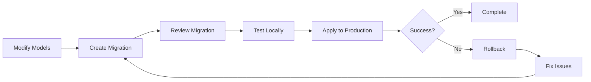

# 🗄️ Database Migrations Guide

Complete guide for managing database migrations using Alembic.

---

## 📋 Table of Contents

1. [Overview](#overview)
2. [Migration Process](#migration-process)
3. [Creating Migrations](#creating-migrations)
4. [Applying Migrations](#applying-migrations)
5. [Rollback Strategies](#rollback-strategies)
6. [Migration Best Practices](#migration-best-practices)
7. [Troubleshooting](#troubleshooting)

---

## 🎯 Overview

This project uses **Alembic** for database migrations. Alembic is a database migration tool for SQLAlchemy that allows you to version control your database schema changes.

### Key Concepts

- **Migration**: A script that describes changes to your database schema
- **Revision**: A specific version of your database schema
- **Upgrade**: Applying migrations to move forward
- **Downgrade**: Rolling back migrations to move backward

---

## 🔄 Migration Process

### Workflow



### Step-by-Step Process

1. **Modify SQLAlchemy Models** (`backend/app/models/`)
2. **Generate Migration** (`cd backend && pnpm migrate:create MigrationName`)
3. **Review Migration File** (`backend/alembic/versions/`)
4. **Test Locally** (`cd backend && pnpm migrate:upgrade`)
5. **Commit to Git**
6. **Deploy to Production**
7. **Run Migrations** (automatically or manually)

---

## 📝 Creating Migrations

### Automatic Migration Generation

**Recommended**: Let Alembic auto-detect changes from your models.

```bash
# From backend directory
cd backend
pnpm migrate:create AddUserTable

# Or directly with Alembic
alembic revision --autogenerate -m "AddUserTable"
```

**What it does**:
- Compares current models with database schema
- Generates migration script automatically
- Creates file in `backend/alembic/versions/`

### Manual Migration Creation

For complex migrations or data transformations:

```bash
cd backend && pnpm migrate:create ManualMigrationName
```

Then edit the generated file in `backend/alembic/versions/`:

```python
"""Add user preferences table

Revision ID: abc123
Revises: xyz789
Create Date: 2025-01-25 10:00:00
"""
from alembic import op
import sqlalchemy as sa

# revision identifiers
revision = 'abc123'
down_revision = 'xyz789'
branch_labels = None
depends_on = None

def upgrade():
    # Your upgrade logic
    op.create_table(
        'user_preferences',
        sa.Column('id', sa.UUID(), nullable=False),
        sa.Column('user_id', sa.UUID(), nullable=False),
        sa.Column('preference_key', sa.String(), nullable=False),
        sa.Column('preference_value', sa.String(), nullable=True),
        sa.PrimaryKeyConstraint('id'),
        sa.ForeignKeyConstraint(['user_id'], ['users.id']),
    )
    op.create_index('ix_user_preferences_user_id', 'user_preferences', ['user_id'])

def downgrade():
    # Your rollback logic
    op.drop_index('ix_user_preferences_user_id', table_name='user_preferences')
    op.drop_table('user_preferences')
```

---

## ⬆️ Applying Migrations

### Check Current Migration Status

```bash
# View current revision
cd backend && pnpm migrate:current

# View migration history
cd backend && pnpm migrate:history
```

### Apply All Pending Migrations

```bash
# Apply all migrations up to head
cd backend && pnpm migrate:upgrade

# Or specify target revision
cd backend && pnpm migrate:upgrade abc123
```

### Apply Single Migration

```bash
# Apply next migration only
cd backend && pnpm migrate:upgrade +1

# Or use Alembic directly
cd backend
alembic upgrade +1
```

### Production Deployment

**Option 1: Automatic (Recommended)**

Add to deployment script or Railway/Vercel:

```bash
# In backend/entrypoint.sh or Railway start command
alembic upgrade head
uvicorn app.main:app --host 0.0.0.0 --port $PORT
```

**Option 2: Manual**

```bash
# Via Railway CLI
railway run alembic upgrade head

# Via Docker
docker exec -it container_name alembic upgrade head
```

---

## ⬇️ Rollback Strategies

### Understanding Rollbacks

Rollbacks allow you to undo migrations. **⚠️ Warning**: Data loss may occur if migrations remove columns/tables.

### Rollback Commands

#### Rollback One Migration

```bash
# Rollback last migration
cd backend && pnpm migrate:downgrade

# Or explicitly
cd backend && pnpm migrate:downgrade -1
```

#### Rollback Multiple Migrations

```bash
# Rollback 3 migrations
cd backend && pnpm migrate:downgrade -3

# Rollback to specific revision
cd backend && pnpm migrate:downgrade abc123
```

#### Rollback to Base (⚠️ DANGEROUS)

```bash
# Rollback all migrations
cd backend && pnpm migrate:downgrade base
```

**⚠️ Warning**: This will remove all tables and data!

### Rollback Scenarios

#### Scenario 1: Failed Migration in Production

```bash
# 1. Identify failed migration
cd backend && pnpm migrate:current

# 2. Rollback failed migration
cd backend && pnpm migrate:downgrade -1

# 3. Fix migration file
# Edit backend/alembic/versions/xxx_failed_migration.py

# 4. Test locally
cd backend && pnpm migrate:upgrade

# 5. Redeploy and apply
cd backend && pnpm migrate:upgrade
```

#### Scenario 2: Data Corruption After Migration

```bash
# 1. Backup database first!
pg_dump $DATABASE_URL > backup.sql

# 2. Rollback migration
cd backend && pnpm migrate:downgrade -1

# 3. Restore data if needed
psql $DATABASE_URL < backup.sql

# 4. Fix migration and reapply
```

#### Scenario 3: Rollback Before Fixing

```bash
# 1. Rollback to previous stable version
cd backend && pnpm migrate:downgrade stable_revision_id

# 2. Fix issues in code/migration

# 3. Create new migration or fix existing
cd backend && pnpm migrate:create FixIssue

# 4. Apply fixed migration
cd backend && pnpm migrate:upgrade
```

### Safe Rollback Checklist

Before rolling back:

- [ ] **Backup Database** - Always backup before rollback
- [ ] **Check Dependencies** - Ensure no other migrations depend on this one
- [ ] **Review Migration** - Understand what will be removed
- [ ] **Test Locally** - Test rollback in development first
- [ ] **Notify Team** - Inform team of rollback
- [ ] **Document Reason** - Record why rollback was necessary

### Rollback Best Practices

1. **Always Backup First**
   ```bash
   # PostgreSQL backup
   pg_dump $DATABASE_URL > backup_$(date +%Y%m%d_%H%M%S).sql
   ```

2. **Test Rollback Locally**
   ```bash
   # Create test database
   createdb test_db
   
   # Apply migrations
   alembic upgrade head
   
   # Test rollback
   alembic downgrade -1
   
   # Verify schema
   ```

3. **Use Transactions** (Alembic does this automatically)

4. **Rollback During Low Traffic** (if possible)

5. **Monitor After Rollback**
   - Check application logs
   - Verify database integrity
   - Test critical functionality

---

## 🎯 Migration Best Practices

### 1. Naming Conventions

**Good Names**:
```
AddUserTable
AddEmailIndexToUsers
CreateSubscriptionTables
AddThemePreferenceColumn
```

**Bad Names**:
```
migration1
fix
update
changes
```

### 2. Migration Structure

```python
def upgrade():
    # 1. Create tables
    op.create_table(...)
    
    # 2. Add columns
    op.add_column(...)
    
    # 3. Create indexes
    op.create_index(...)
    
    # 4. Add foreign keys
    op.create_foreign_key(...)
    
    # 5. Data migrations (if needed)
    # op.execute("UPDATE ...")

def downgrade():
    # Reverse order of upgrade
    # 5. Remove data migrations
    # 4. Remove foreign keys
    op.drop_constraint(...)
    # 3. Remove indexes
    op.drop_index(...)
    # 2. Remove columns
    op.drop_column(...)
    # 1. Drop tables
    op.drop_table(...)
```

### 3. Data Migrations

For data transformations:

```python
def upgrade():
    # Schema changes first
    op.add_column('users', sa.Column('full_name', sa.String()))
    
    # Then data migration
    connection = op.get_bind()
    connection.execute(
        sa.text("UPDATE users SET full_name = first_name || ' ' || last_name")
    )
    
    # Then make column required (if needed)
    op.alter_column('users', 'full_name', nullable=False)

def downgrade():
    op.drop_column('users', 'full_name')
```

### 4. Handling Large Migrations

For large schema changes:

```python
def upgrade():
    # Use batch operations for SQLite compatibility
    with op.batch_alter_table('users') as batch_op:
        batch_op.add_column(sa.Column('new_field', sa.String()))
        batch_op.drop_column('old_field')
```

### 5. Migration Dependencies

```python
# Specify dependencies
depends_on = ('abc123', 'xyz789')  # Multiple dependencies
```

### 6. Testing Migrations

```bash
# Test upgrade
cd backend && pnpm migrate:upgrade head

# Test downgrade
cd backend && pnpm migrate:downgrade -1

# Test upgrade again
cd backend && pnpm migrate:upgrade head

# Verify schema
psql $DATABASE_URL -c "\d users"
```

---

## 🐛 Troubleshooting

### Migration Conflicts

**Error**: `Multiple heads detected`

**Solution**:
```bash
# Merge heads
alembic merge -m "Merge heads" head1 head2
```

### Missing Revision

**Error**: `Can't locate revision identified by 'abc123'`

**Solution**:
```bash
# Check migration history
cd backend && pnpm migrate:history

# Verify migration file exists
ls backend/alembic/versions/

# If missing, restore from git or recreate
```

### Database Out of Sync

**Error**: Database schema doesn't match models

**Solution**:
```bash
# Check current revision
cd backend && pnpm migrate:current

# Stamp database to match code
cd backend && alembic stamp head

# Or create new migration to sync
cd backend && pnpm migrate:create SyncSchema
```

### Migration Fails Midway

**Error**: Migration fails partway through

**Solution**:
```bash
# 1. Check current state
cd backend && pnpm migrate:current

# 2. Manually fix database if needed
psql $DATABASE_URL

# 3. Stamp to correct revision
cd backend && alembic stamp revision_id

# 4. Continue or rollback
cd backend && pnpm migrate:upgrade
# or
cd backend && pnpm migrate:downgrade -1
```

### Foreign Key Violations

**Error**: Foreign key constraint fails during rollback

**Solution**:
```python
def downgrade():
    # Drop foreign keys first
    op.drop_constraint('fk_name', 'table_name', type_='foreignkey')
    
    # Then drop tables/columns
    op.drop_table('table_name')
```

### Production Migration Issues

**Error**: Migration fails in production

**Solution**:
1. **Stop Application** (if possible)
2. **Backup Database**
3. **Rollback Migration**
4. **Fix Issue**
5. **Test Locally**
6. **Redeploy**

---

## 📊 Migration Commands Reference

### Quick Reference

```bash
# Create migration
cd backend && pnpm migrate:create MigrationName

# Apply migrations
cd backend && pnpm migrate:upgrade          # Apply all
cd backend && pnpm migrate:upgrade +1      # Apply one
cd backend && pnpm migrate:upgrade abc123  # Apply to revision

# Rollback migrations
cd backend && pnpm migrate:downgrade       # Rollback one
cd backend && pnpm migrate:downgrade -3    # Rollback three
cd backend && pnpm migrate:downgrade abc123 # Rollback to revision

# Check status
cd backend && pnpm migrate:current         # Current revision
cd backend && pnpm migrate:history         # Migration history

# Stamp database
cd backend && alembic stamp abc123    # Mark database at revision
```

### Alembic Direct Commands

```bash
cd backend

# Show current revision
alembic current

# Show history
alembic history
alembic history --verbose

# Show SQL for migration (without applying)
alembic upgrade head --sql

# Show SQL for rollback
alembic downgrade -1 --sql
```

---

## 🔐 Production Migration Checklist

Before running migrations in production:

- [ ] **Backup Database** - Full database backup
- [ ] **Test Locally** - Test migration in development
- [ ] **Review Migration** - Understand all changes
- [ ] **Check Dependencies** - Verify no conflicts
- [ ] **Low Traffic Window** - Schedule during low usage
- [ ] **Monitor Logs** - Watch for errors
- [ ] **Verify Application** - Test after migration
- [ ] **Document Changes** - Record migration details

---

## 📚 Additional Resources

- [Alembic Documentation](https://alembic.sqlalchemy.org/)
- [SQLAlchemy Migrations](https://docs.sqlalchemy.org/en/20/core/metadata.html)
- [Database Migration Best Practices](https://www.prisma.io/dataguide/types/relational/migrations)

---

**Last Updated**: 2025-01-25

